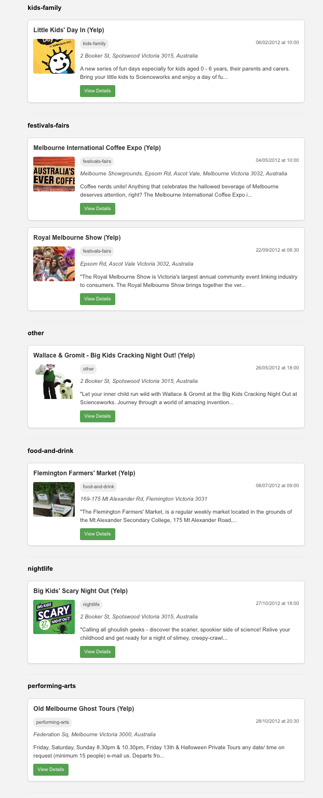

# Events Around - React Native Code Test

## Overview
This is a code test for React Native developers. The purpose of this test is to evaluate your ability to:
- Work with an existing codebase
- Implement API integrations
- Apply styling best practices
- Create reusable components
- Transform and aggregate data from multiple sources
- Write clean, maintainable, testable code using typescript

## Project Description
"Events Around" is a mobile application that displays events happening near a user's location (data will be mocked so accurate location is not relevant). The app aggregates event data from multiple providers (Yelp, Ticketmaster, and Foursquare) and displays them in a categorized list.





## Getting Started
1. Clone this repository
2. Install dependencies: `npm install` or `yarn`
3. Run the app: `npm run ios` or `npm run android`

## Current State
The app is currently in a minimal state with:
- A main screen with the title "What's happening around?"
- An empty events list with "No events found" message
- Mock API data files for Yelp, Ticketmaster, and Foursquare in "mock-data" folder

## Requirements

### 1. API Integration
- Create API service modules to fetch event data from the mock JSON files
- Implement proper error handling and loading states
- Structure your service code to be easily testable and maintainable

### 2. Data Transformation
- Aggregate data from all three sources into a unified format
- Group events by categories
- Create utility functions to format dates, prices, and other data

### 3. UI Implementation
- Refactor the existing styling to use Tailwind
- Create a responsive event card component
- Implement a list view for displaying multiple events
- Add pull-to-refresh functionality
- Display appropriate loading/error/empty states

### 4. Navigation
- Implement navigation to an event details screen
- Create a back navigation pattern
- Pass appropriate data between screens

### 5. State Management (MobX)
- Implement MobX stores for managing application state (UI state, events, locations, favorites,... )
- Use observable properties and actions for state mutations
- Implement computed values for derived data (categorized events, filtered results)
- Ensure UI components react to store changes using observer HOC
- Avoid MobX-state-tree - use plain MobX classes instead

### 6. Additional Features (Optional, you can do none or as many as you want)
- Show how you would handle the location to be used by different APIS that can either accept latitude/longitude, and/or zip codes, and/or cities when your location data is an address in this format :
```
{
  "street number": string,
  "street line": string,
  "zip": string,
  "city": string,
  "country": string,
}
```
This does not have to work as data response are mocked, just show how you would handle location to pass it as a parameter to the api queries.
- In the Event details page, embed a map location of the event.
- Internationalization/Localization (at least for the interface, it does not matter for the text from event data).
- Add an ability to add the event to the user calendar
- Add a save to favorite flowm, storing favorites in local storage.

## Evaluation Criteria
Your submission will be evaluated on:
- **Code quality**: Clean, readable, and well-structured code
- **Component design**: Reusable and well-architected components
- **State management**: Proper state handling and data flow
- **Styling**: Consistent and responsive UI
- **Error handling**: Graceful handling of edge cases
- **Performance**: Efficient rendering and data processing
- **Documentation**: Clear comments and documentation

## Submission Guidelines
1. Create a fork of this repository
2. Complete the required tasks
3. Submit a pull request
4. Include a brief explanation of your implementation decisions

## Time Expectation
The test is designed to take approximately 4-6 hours to complete the core requirements. Please focus on quality over quantity.

## Notes
- You are free to use any additional libraries that you think are appropriate
- The mock data is provided in the repository to avoid requiring API keys
- Feel free to ask questions if anything is unclear
